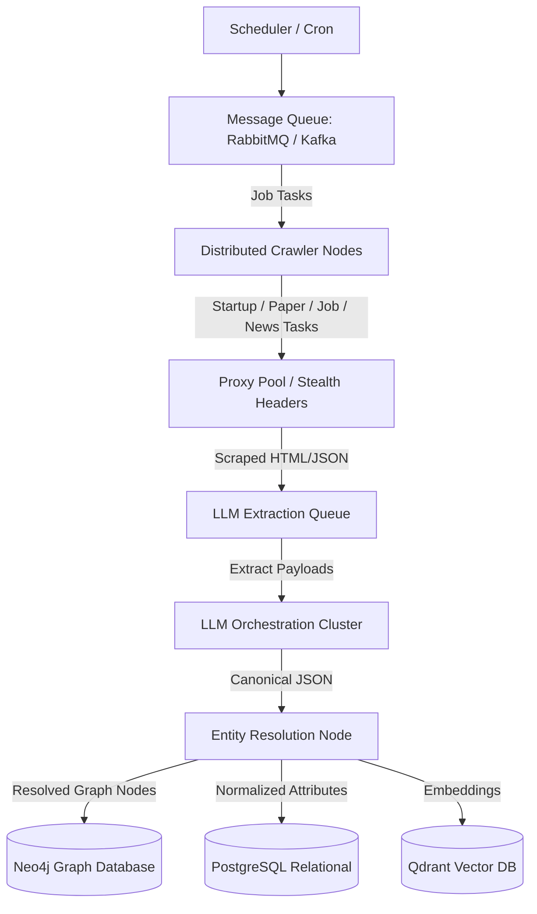
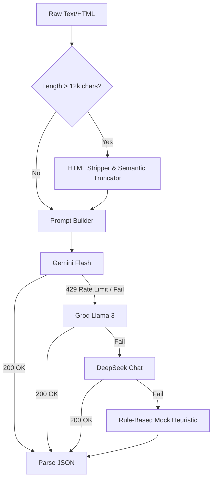
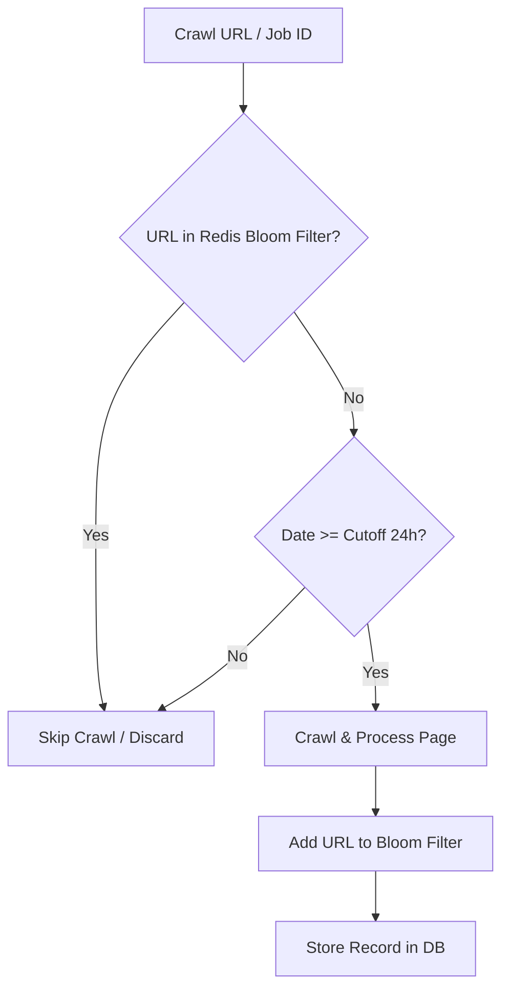

# GraphOne Venture Ecosystem Ingestion Pipeline: Architectural Design

This document details the architectural design, scaling strategy, and engineering decisions behind the GraphOne Data Ingestion Pipeline.

---

## 1. Massive Scale Strategy (Ingesting 500,000+ Records)

To scale the pipeline from the current ~5,000 records to **500,000+ startups, products, and research papers** without manual intervention, a distributed, event-driven queue architecture is required.

### Key Engineering Pillars for Scale:
1. **Event-Driven Task Queues (Celery + RabbitMQ / Kafka)**:
   * Scraping jobs must be broken down into granular, idempotent tasks (e.g., `crawl_startup_page`, `resolve_github_stars`, `extract_product_pricing`).
   * Workers run asynchronously on containerized environments (Kubernetes pods) that auto-scale based on queue backlog depth.
2. **Distributed Crawler Nodes**:
   * Deploy lightweight scraping microservices. Scraping nodes must be stateless, writing raw crawled payloads to an Object Store (Amazon S3 / Google Cloud Storage) as a data lake before processing.
3. **Anti-Bot & Proxy Rotation**:
   * Residential proxy networks (e.g., Bright Data, Oxylabs) with automatic rotation, session management, and HTTP/2 fingerprinting.
   * Playwright Async/Puppeteer running in headless mode with stealth packages (`puppeteer-extra-plugin-stealth`) to bypass Cloudflare, Datadome, and Akamai.

---

## 2. LLM Engine: Context Window (413) & Rate Limit (429) Handling

Orchestrating thousands of concurrent LLM calls requires defensive payload validation and throttling controls.

### Handling Payload Limits (HTTP 413)
* **Pre-Parsing Text Extraction**: Raw HTML is stripped of CSS, JS, boilerplate navbars, and headers using `BeautifulSoup`.
* **Token Budgeting / Truncation**: Inputs are capped (typically at 12,000 characters) before prompt assembly. Text is truncated at sentence boundaries to ensure semantic density remains high.

### Handling Rate Limits (HTTP 429)
* **Multi-Tier Fallback Chain**: Sequential failover across three independent LLM APIs: `Gemini Flash` -> `Groq Llama 3` -> `DeepSeek`.
* **Exponential Backoff with Jitter**: Implements the decorator pattern:
  $$\text{Delay} = \min(\text{MaxDelay}, \text{BaseDelay} \times 2^{\text{retry}} + \text{random\_jitter})$$
  This separates retry intervals and prevents the "thundering herd" problem on API endpoints.

---

## 3. Freshness Tracking & Duplicate Prevention

To enforce the **24-hour freshness** constraint for news and jobs across distributed crawler nodes and ensure we never process or download the same article/job twice, we implement a multi-layered deduplication filter.

### The Ingestion Guardrails:
1. **Redis Bloom Filters**:
   * Crawl urls or unique job IDs are run through a memory-efficient Redis Bloom Filter before network fetching. A Bloom Filter checks set membership in $O(1)$ time with negligible memory footprints ($< 1$ MB for 1M items).
2. **Watermark / State Tracking**:
   * RSS/Atom feeds and Greenhouse listings track an incremental `updated_at` timestamp. Our cron jobs maintain a "high watermark" cursor (the latest timestamp seen in the previous run).
   * Subsequent polls request only records where `timestamp > watermark`, reducing data egress.

---

## 4. Venture Storage Strategy

A multi-model database strategy is recommended to capture the structured, unstructured, and relational nature of the startup ecosystem.

| Database Type | Choice | Justification |
| :--- | :--- | :--- |
| **Primary Relational** | **PostgreSQL** | Acts as the single source of truth for normalized tables (`Startups`, `Products`, `Jobs`, `News`). Excellent ACID compliance, JSONB support for semi-structured fields, and index scaling. |
| **Graph Database** | **Neo4j** | Essential for mapping complex relationships: `Startup -[BUILDS]-> Product`, `Paper -[SPAWNED_CODE]-> GithubRepo`, `Startup -[EMPLOYED]-> Founder`. Allows fast multi-hop traversal to uncover venture signals. |
| **Vector Storage** | **Qdrant** | Stores text embeddings of news articles, research paper abstracts, and job descriptions for semantic search, recommendation algorithms, and entity clustering. |

---

## 5. Entity Resolution Mechanics

Messy textual data is normalized into canonical startups and products using a hybrid matching approach:
1. **Deterministic Suffix Cleaning**: Custom regular expressions strip endings like `Inc.`, `Corp.`, `Co.`, and normalize character encodings and spacing.
2. **Space-Insensitive Direct Matching**: Capitalization and space-stripped lookups (e.g. `open ai` $\rightarrow$ `openai`) are performed against the seed database.
3. **Fuzzy Similarity Sorting**: Using RapidFuzz's token sort ratio (Levenshtein distance sorting words alphabetically), matching variations like `Mistral AI France` to the canonical `Mistral AI` with high precision.
